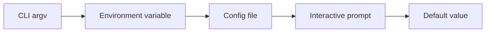

# Flags

Flags are the richest primitive in `dreamcli`.
Each flag declaration configures parsing, type inference, resolution, help text, and shell completions.

## Flag Types

### String

```ts twoslash
import { flag, type InferFlag } from '@kjanat/dreamcli';

const stringFlag = flag.string();

declare const flagTypes: {
  string: InferFlag<typeof stringFlag>;
};
// ---cut---
flagTypes.string;
//          ^?
```

### Number

```ts twoslash
import { flag, type InferFlag } from '@kjanat/dreamcli';

const numberFlag = flag.number();

declare const flagTypes: {
  number: InferFlag<typeof numberFlag>;
};
// ---cut---
flagTypes.number;
//         ^?
```

### Boolean

```ts twoslash
import { flag, type InferFlag } from '@kjanat/dreamcli';

const booleanFlag = flag.boolean();

declare const flagTypes: {
  boolean: InferFlag<typeof booleanFlag>;
};
// ---cut---
flagTypes.boolean;
//         ^?
```

### Enum

```ts twoslash
import { flag, type InferFlag } from '@kjanat/dreamcli';

const enumFlag = flag.enum(['us', 'eu', 'ap']);

declare const flagTypes: {
  enum: InferFlag<typeof enumFlag>;
};
// ---cut---
flagTypes.enum;
//         ^?
```

### Array

```ts twoslash
import { flag, type InferFlag } from '@kjanat/dreamcli';

const arrayFlag = flag.array(flag.string());

declare const flagTypes: {
  array: InferFlag<typeof arrayFlag>;
};
// ---cut---
flagTypes.array;
//         ^?
```

### Custom

```ts twoslash
import { flag, type InferFlag } from '@kjanat/dreamcli';

const customFlag = flag.custom((v) => new URL(String(v)));

declare const flagTypes: {
  custom: InferFlag<typeof customFlag>;
};
// ---cut---
flagTypes.custom;
//         ^?
```

Array flags are the one optional flag kind that still resolve to a value when
unset: if no CLI/env/config/prompt/default value is found, they fall back to
an empty array `[]`.

For the exact parser rules around repeated flags, short-flag stacking, `--`
separator handling, and `--no-*` spellings, see [CLI Semantics](/guide/semantics).

## Modifiers

Every flag type supports the same modifier chain:

```ts twoslash
import { flag } from '@kjanat/dreamcli';

flag
  .string()
  // short alias: -r
  .alias('r')
  // help text
  .describe('Target region')
  // default value (narrows type)
  .default('us')
  // must resolve or error
  .required()
  // resolve from env var
  .env('DEPLOY_REGION')
  // resolve from config file
  .config('deploy.region')
  // interactive fallback
  .prompt({ kind: 'input', message: 'Region?' })
  // deprecation warning
  .deprecated('Use --target instead')
  // inherit in subcommands
  .propagate();
```

## Resolution Chain

Each flag resolves through an ordered pipeline. Every step is opt-in:



The first source that provides a value wins.
Required flags that don't resolve produce a structured error before the action handler runs.

### Example

```ts twoslash
import { flag } from '@kjanat/dreamcli';

flag
  .enum(['us', 'eu', 'ap'])
  .env('DEPLOY_REGION')
  .config('deploy.region')
  .prompt({ kind: 'select', message: 'Which region?' })
  .default('us');
```

Resolution order:

1. `--region eu` on the command line
2. `DEPLOY_REGION=eu` in environment
3. `deploy.region: "eu"` in config file
4. Interactive select prompt (TTY only)
5. Default value `"us"`

## Required vs Optional

### Optional

```ts twoslash
import { flag, type InferFlag } from '@kjanat/dreamcli';

const optionalFlag = flag.string();

declare const requiredVsOptional: {
  optional: InferFlag<typeof optionalFlag>;
};
// ---cut---
requiredVsOptional.optional;
//                    ^?
```

### Defaulted

```ts twoslash
import { flag, type InferFlag } from '@kjanat/dreamcli';

const defaultedFlag = flag.string().default('hello');

declare const requiredVsOptional: {
  defaulted: InferFlag<typeof defaultedFlag>;
};
// ---cut---
requiredVsOptional.defaulted;
//                    ^?
```

### Required

```ts twoslash
import { flag, type InferFlag } from '@kjanat/dreamcli';

const requiredFlag = flag.string().required();

declare const requiredVsOptional: {
  required: InferFlag<typeof requiredFlag>;
};
// ---cut---
requiredVsOptional.required;
//                    ^?
```

### Boolean

```ts twoslash
import { flag, type InferFlag } from '@kjanat/dreamcli';

const booleanFlag = flag.boolean();

declare const requiredVsOptional: {
  boolean: InferFlag<typeof booleanFlag>;
};
// ---cut---
requiredVsOptional.boolean;
//                  ^?
```

## Custom Parsing

```ts twoslash
import { flag } from '@kjanat/dreamcli';

flag.custom((value) => {
  const url = new URL(String(value));
  if (url.protocol !== 'https:') {
    throw new Error('URL must use HTTPS');
  }
  return url;
});
```

The parse function receives the raw string value and returns the parsed type.
Thrown errors become validation errors with the flag name in context.

## Propagation

Flags marked with `.propagate()` are inherited by all subcommands:

```ts twoslash
import { cli, command, flag } from '@kjanat/dreamcli';

const nested = command('start')
  .flag('verbose', flag.boolean().alias('v').propagate())
  .action(({ flags, out }) => {
    if (flags.verbose) {
      out.info('Verbose mode enabled');
    }
  });
// ---cut-start---
// ---cut-end---

cli('mycli').command(
  command('deploy')
    .flag('verbose', flag.boolean().alias('v').propagate())
    .command(nested),
);
```

## What's Next?

- [Arguments](/guide/arguments) — positional argument types
- [Config Files](/guide/config) — config file resolution
- [Interactive Prompts](/guide/prompts) — prompt integration
- [CLI Semantics](/guide/semantics) — exact parser and precedence rules
