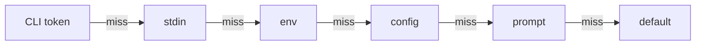

# Arguments

Positional arguments are declared with `arg` and appear after the command name.

## Five Axes

An argument declaration decides the same five things a
[flag](/guide/flags#five-axes) declaration does:

| Axis                        | What it decides                                         | Declared with                                                            |
| --------------------------- | ------------------------------------------------------- | ------------------------------------------------------------------------ |
| [Value](#value)             | what one value is and what type it resolves to          | `arg.string()`, `arg.number()`, `arg.url()`, `arg.custom()`, and the rest |
| [Cardinality](#cardinality) | how many values the slot carries and how they combine    | `.variadic()`, `arg.keyValue()`, `.split()`, `.unique()`                 |
| [Sources](#sources)         | where a value may come from and which one wins           | `.stdin()`, `.env()`, `.config()`, `.prompt()`, `.default()`             |
| [Syntax](#syntax)           | how the slot is filled on the command line               | declaration order, `.optional()`, `.variadic()` placement                |
| [Validation](#validation)   | what a resolved value has to satisfy                     | constraints, `.standard()`, `arg.path()` filesystem checks               |

Value, sources, and validation are identical to the flag surface: the same
kinds, the same option objects, the same parsers, the same six-stage chain, the
same error codes. Cardinality differs only in how the command line spells a
collection, since a positional tail replaces a repeated token. Syntax is the
axis that genuinely differs, and
[what the arg factory does not have](#flag-only-surface) enumerates exactly what
is left on `flag` because of it.

## Value

Ten kinds describe what one value is, matching
[the flag kinds](/guide/flags#flag-types) one for one.

### String

```ts twoslash
import { arg, type InferArg } from '@kjanat/dreamcli';

const stringArg = arg.string();

declare const argTypes: {
  string: InferArg<typeof stringArg>;
};
argTypes.string;
//         ^?
```

`arg.string()` also accepts [string constraints](#string-constraints).

### Number

```ts twoslash
import { arg, type InferArg } from '@kjanat/dreamcli';

const numberArg = arg.number();

declare const argTypes: {
  number: InferArg<typeof numberArg>;
};
argTypes.number;
//         ^?
```

`arg.number()` also accepts [numeric constraints](#numeric-constraints).

### Boolean

`arg.boolean()` consumes an explicit token. A positional carries no presence
semantics, so the value is spelled out:

```ts
arg.boolean(); // `mycli feature true` → true
// `mycli feature nope` → Invalid boolean value 'nope' for argument <enabled>
```

Argv accepts `true`/`false` and `1`/`0`. Env, config, stdin, and prompt values
also accept `yes`/`no` and an empty string, which a prompt or an exported
variable is likely to carry. Help renders the slot by its own name:

```
Usage: feature [flags] <enabled>

Arguments:
  <enabled>  Whether the feature is on
```

### Enum

```ts twoslash
import { arg, type InferArg } from '@kjanat/dreamcli';

const enumArg = arg.enum(['us', 'eu', 'ap']);

declare const argTypes: {
  enum: InferArg<typeof enumArg>;
};
// ---cut---
argTypes.enum;
//        ^?
```

A value outside the set is rejected with the allowed values listed:

```
Invalid value 'mars' for argument <region>. Allowed: us, eu, ap
```

Usage renders the choices rather than the slot name, so
`arg.enum(['us', 'eu', 'ap'])` shows as `<us|eu|ap>`.

### Custom

```ts twoslash
import { arg, type InferArg } from '@kjanat/dreamcli';

const customArg = arg.custom((v) => v.split(',').map(Number));

declare const argTypes: {
  custom: InferArg<typeof customArg>;
};
argTypes.custom;
//         ^?
```

`arg.custom()` also accepts any [Standard Schema v1](https://standardschema.dev/schema)
validator. See [Standard Schema](#standard-schema).

A custom positional can declare every source. Chain `.env()`, `.config()`, and
`.prompt()` on the `arg.custom()` builder and its parse function runs on
whichever raw source wins. A value supplied by `.default()` is already typed and
is not parsed again.

### Purpose-Built Argument Kinds

Five factories mirror their [flag counterparts](/guide/flags#flag-types)
exactly: same value types, same option objects, same parsers, same error codes.
Reach for one of these before `arg.custom()` with a hand-written parser.

| Factory          | Resolved type | Accepts                                          |
| ---------------- | ------------- | ------------------------------------------------ |
| `arg.url()`      | `URL`         | any URL, optionally restricted by protocol       |
| `arg.path()`     | `string`      | any string, with optional filesystem checks      |
| `arg.date()`     | `Date`        | strict ISO-8601, optional `min` / `max` bounds   |
| `arg.duration()` | `number` (ms) | `'30s'`, `'1h30m'`, `'250ms'`, or a bare number  |
| `arg.bytes()`    | `number`      | `'512mb'`, `'1.5gb'`, `'64kb'`, or a bare number |

All five compose with `.optional()`, `.default()`, `.variadic()`, `.stdin()`,
`.env()`, `.config()`, `.prompt()`, `.describe()`, and `.deprecated()`, under
the same rules as any other argument. A variadic one validates each collected
value separately.

#### URL

Parses into a `URL`; invalid URLs are rejected with the argument named in the
error. Optionally restrict protocols:

```ts twoslash
import { arg, type InferArg } from '@kjanat/dreamcli';

const urlArg = arg.url({ protocols: ['https'] });

declare const argTypes: {
  url: InferArg<typeof urlArg>;
};
// ---cut---
argTypes.url;
//        ^?
```

#### Path

The value stays a `string`, with optional filesystem checks that run **after
resolution**. See [Filesystem checks](#filesystem-checks).

```ts
arg.path(); // any string
arg.path({ mustExist: true }); // rejects missing paths
arg.path({ type: 'directory' }); // must exist and be a directory
arg.path({ type: 'directory', mustExist: false }); // missing passes; existing must be a directory
arg.path({ type: 'directory', create: true }); // created recursively when missing
```

`arg.path()` resolves as a `string`, so a value read from stdin keeps the buffer
byte for byte, trailing line terminator included. `echo ./docs | mycli` reaches
a `mustExist` check as `'./docs\n'` and fails:

```
Path './docs
' for argument <p> does not exist
```

`.stdin({ trim: true })` drops that terminator, so `echo ./docs | mycli` reaches
the check as `'./docs'`. `printf './docs'` works too.

Help renders a positional by its own name, so `arg.path()` shows `<outDir>`
rather than the `<path>` placeholder its flag counterpart uses. That keeps
`mycli copy <src> <dst>` readable instead of collapsing to `<path> <path>`.

#### Date

Accepts strict ISO-8601 (`2026-07-10`, `2026-07-10T14:30:00Z`) and parses into
a `Date`. Lenient `Date.parse` inputs (`'0'`, `'March 5'`) and calendar-invalid
dates (`2026-02-31`) are rejected. Offset-less datetimes (`2026-07-10T14:30`)
are treated as **UTC**, not local time, so `min` / `max` acceptance never
depends on the machine's timezone. Optional inclusive `min` / `max` bounds:

```ts twoslash
import { arg, type InferArg } from '@kjanat/dreamcli';

const dateArg = arg.date({ min: new Date('2020-01-01') });

declare const argTypes: {
  date: InferArg<typeof dateArg>;
};
// ---cut---
argTypes.date;
//         ^?
```

#### Duration

Accepts `'30s'`, `'5m'`, `'1.5h'`, `'250ms'`, `'2d'`, compounds like `'1h30m'`,
or a bare millisecond count, and resolves to **milliseconds**:

```ts
arg.duration().default(30_000);
// mycli wait 45s   → 45000
// mycli wait 1h30m → 5400000
```

#### Bytes

Accepts `'512mb'`, `'1.5gb'`, `'64kb'`, `'100b'` or a bare byte count, and
resolves to **bytes**. Units are binary (`1kb` = 1024) and case-insensitive:

```ts
arg.bytes().default(10 * 1024 ** 2);
// mycli split 512kb → 524288
```

## Cardinality

An argument carries one value, an ordered list, or a record of key-value
entries. There is no positional counterpart to `flag.count()`, which counts how
often a named token appears.

| Form    | Declared by                            | Unset resolves to |
| ------- | -------------------------------------- | ----------------- |
| one     | every value kind                       | `undefined`       |
| list    | `.variadic()` on any kind              | `[]`              |
| entries | `arg.keyValue()`                       | `{}`              |

### Variadic Arguments

The last argument can be variadic, collecting all remaining positional values.
It takes every remaining token, so it has to be the last one a command declares:
another positional after it, variadic or not, throws `INVALID_BUILDER_STATE`.

```ts twoslash
import { arg, command } from '@kjanat/dreamcli';

command('copy')
  .arg(
    'files',
    arg.string().variadic().describe('Files to copy'),
  )
  .action(({ args }) => {
    args.files;
    //     ^?
  });
```

```bash
$ mycli copy a.txt b.txt c.txt
# args.files = ['a.txt', 'b.txt', 'c.txt']
```

Anything registered behind a variadic argument could never be filled, so both
construction paths refuse it:

```ts
command('copy').arg('files', arg.string().variadic()).arg('target', arg.string());
```

```
Argument <target> comes after variadic argument <files>, which consumes every remaining positional
Suggestion: Declare <target> before <files>, or drop .variadic() from <files>
```

A second variadic argument is the same error, since the first one leaves it
nothing to collect. `details` carries the command in `command`, the argument
that could never fill in `arg`, and the greedy one in `variadicArg`, so a
definition tree names the nested command that declared the pair. Every earlier
ordering still builds: required then optional then variadic, a lone variadic, a
scalar followed by a `arg.keyValue().variadic()` tail.

### Key-Value Arguments {#key-value-arguments}

`arg.keyValue()` consumes `KEY=VALUE` tokens and resolves to
`Record<string, string>`, splitting each at the first `=`. The non-variadic form
reads one token; the variadic form aggregates the whole tail into one record:

```ts twoslash
import { arg, type InferArg } from '@kjanat/dreamcli';

const vars = arg.keyValue().variadic();

declare const argTypes: { vars: InferArg<typeof vars> };
// ---cut---
argTypes.vars;
//        ^?
```

```bash
$ mycli render a=1 b=2 a=3
# args.vars === { a: '3', b: '2' }
```

`.duplicateKeys()` decides what a repeated key means, on every source: `'last'`
(the default), `'first'`, or `'error'`. The per-source table under
[Collections](/guide/flags#collections) applies unchanged, so env values carry
comma-delimited pairs until `.split({ env })` says otherwise, and a config value
is read as a native object.

An element builder gives each entry value its own codec, constraints, filesystem
checks, and validator, exactly as `flag.keyValue(element)` does. Without one,
entry values are strings:

```ts twoslash
import { arg, type InferArg } from '@kjanat/dreamcli';

const replicas = arg.keyValue(arg.number().int().min(0)).variadic();

declare const argTypes: { replicas: InferArg<typeof replicas> };
// ---cut---
argTypes.replicas;
//        ^?
```

```bash
$ mycli scale web=3 api=2
# args.replicas === { web: 3, api: 2 }

$ mycli scale web=-1
# Error: must be >= 0
```

The element is a builder that still describes a value alone. The modifiers that
describe the positional itself, `.optional()`, `.variadic()`, `.env()`,
`.config()`, `.prompt()`, `.stdin()`, `.describe()`, `.deprecated()`, and
`.default()`, take it out of element position at compile time, since an entry
value is never read for any of them.

A key-value argument can read stdin, where the whole buffer decodes into
entries, and its variadic form splices the buffer into the tail it collects:

```ts
arg.keyValue().stdin();
arg.keyValue().variadic().stdin();
```

```bash
$ printf 'A=1\nB=2\n' | mycli run -
# args.vars === { A: '1', B: '2' }

$ printf 'B=2\n' | mycli run A=1 -
# args.vars === { A: '1', B: '2' }
```

### Collections {#collections}

`.variadic()` and `arg.keyValue()` are the two aggregating forms, and both fill
from every source the argument declares under the rules
[Collections](/guide/flags#collections) sets out for flags. `.split()` sets how
each source decodes, `.separator()` sets the CLI delimiter alone, `.unique()`
deduplicates a variadic array, and `.duplicateKeys()` decides a repeated key:

```ts
arg.string().variadic().split({ cli: ',', env: 'json' });
// mycli build a,b c   →  ['a', 'b', 'c']
// FILES='["a","b"]'   →  ['a', 'b']

arg.keyValue().separator(',');
// mycli run A=1,B=2   →  { A: '1', B: '2' }
```

The CLI delimiter applies to each token whatever the arity, so a non-variadic
`arg.keyValue()` splits its single token the same way the variadic form splits
each token of its tail, and the same way `flag.keyValue()` splits each
occurrence.

These four modifiers are collection modifiers, so they are available on an
argument that aggregates. Each states the shape it needs. `.separator()` and
`.split()` want a variadic argument or `arg.keyValue()`. `.unique()`
deduplicates a list, so it wants a variadic argument of a list kind, and a
key-value argument folds repeated keys through `.duplicateKeys()` instead, which
in turn wants `arg.keyValue()`. The compiler refuses each one elsewhere, and the
definition path throws `INVALID_SCHEMA` at build time:

```ts
arg.string().separator(','); // INVALID_SCHEMA
createArgSchema('string', { unique: true }); // INVALID_SCHEMA
createArgSchema('keyValue', { variadic: true, unique: true }); // INVALID_SCHEMA
```

```
Arg schema field 'separator' requires a collection, received a non-variadic 'string' arg
Suggestion: Add 'variadic: true', declare the arg as kind 'keyValue', or drop 'separator'
```

The values a schema already stores as its own default, `unique: false` and
`duplicateKeys: 'last'`, are exempt on the definition path, so feeding a built
`ArgSchema` back through `createArgSchema()` round-trips. Only the compiler
rejects `.duplicateKeys('last')` on a string argument.

A variadic argument reads stdin like any other, and
[the positional tail](#stdin-tail) describes what a `-` among its tokens does.

## Sources

Arguments walk the same ordered chain flags do, and are CLI-only unless they opt
into extra sources:



```ts twoslash
import { arg } from '@kjanat/dreamcli';

arg.string().stdin().env('DEPLOY_TARGET').config('deploy.target').default('local');
```

### Environment-Backed Arguments

Arguments can fall back to environment variables when the positional value is missing:

```ts twoslash
import { arg, command } from '@kjanat/dreamcli';

command('auth')
  .arg(
    'token',
    arg
      .string()
      .env('API_TOKEN')
      .describe('Token from env'),
  )
  .action(({ args }) => {
    args.token;
    //     ^?
  });
```

If `API_TOKEN=secret` and no CLI value is provided, `args.token === 'secret'`.

### Config-Backed Arguments

`.config()` binds an argument to a dotted key in the loaded config object:

```ts twoslash
import { arg, command } from '@kjanat/dreamcli';

command('deploy')
  .arg(
    'target',
    arg.string().config('deploy.target').default('local'),
  )
  .action(({ args }) => {
    args.target;
    //     ^?
  });
```

```bash
# config: { "deploy": { "target": "eu-west" } }
mycli deploy             # target = 'eu-west'
mycli deploy ap-south    # target = 'ap-south', the CLI token wins
```

The config value is coerced to the argument's declared kind the same way a
flag's is, so `arg.duration().config('y.wait')` accepts both `"1h30m"` and
`5000`. A value that fails non-argv decoding reports `TYPE_MISMATCH`; an enum
mismatch reports `INVALID_ENUM`, and a decoded value that violates a constraint
reports `CONSTRAINT_VIOLATED`. The raw value is redacted in every case.

### Prompt-Backed Arguments

`.prompt()` attaches an interactive prompt that runs when CLI, stdin, env, and
config all produce nothing:

```ts twoslash
import { arg, command } from '@kjanat/dreamcli';

command('deploy')
  .arg(
    'target',
    arg.string().prompt({ kind: 'input', message: 'Target:' }),
  )
  .action(({ args }) => {
    args.target;
    //     ^?
  });
```

```bash
mycli deploy             # asks "Target:"
mycli deploy production  # skips the prompt
```

The prompt kinds an argument accepts follow its value and cardinality, matching
the flag table: `string` takes `input` or `select`, `number` takes `input`,
`enum` takes `select` or `input`, `custom` takes every kind, and a variadic
argument takes `multiselect`, the kind `flag.array()` takes. `arg.keyValue()` is
not promptable, as `flag.keyValue()` is not. An incompatible pairing throws
`CONSTRAINT_VIOLATED` naming the argument:

```
Prompt kind 'confirm' is not compatible with number argument <n>. Use 'input' instead
Prompt kind 'input' is not compatible with variadic string argument <files>. Use 'multiselect' instead
```

Prompts run only when a prompter is available. Without one the argument falls
through to its default, or fails as missing.

### STDIN-Backed Arguments

Arguments can also read from piped stdin with `.stdin()`:

```ts twoslash
import { arg, command } from '@kjanat/dreamcli';

command('format')
  .arg(
    'data',
    arg.string().stdin().describe('Read from STDIN'),
  )
  .action(({ args }) => {
    args.data;
    //     ^?
  });
```

Arguments and flags resolve through the same order:
`CLI → stdin → env → config → prompt → default`. With `stdinData: 'hello'` in
tests or piped input at runtime, `args.data === 'hello'`.

The stdin stage sits ahead of env, so an argument set in the environment still
reads a pipe and the pipe wins. Passing the literal sentinel `-` selects stdin
too, but keeps CLI precedence: the bytes come from the pipe and every later
stage stays out of the way. When nothing was piped, both forms fall through to
env, config, prompt, and the default.

The whole buffer becomes the value. Codecs that preserve text terminators keep
it byte for byte, so `echo hi | mycli` gives a string argument `'hi\n'` and a
path keeps the terminator too. Other codecs remove one framing terminator before
decoding, so `echo 30s` reaches `arg.duration()` as `30s`. `arg.keyValue()`
decodes the buffer into entries, one `KEY=VALUE` per line by default.

`{ trim: true }` drops that terminator for a string argument too, which is what
a piped path wants:

```ts
arg.path({ mustExist: true }).stdin({ trim: true });
```

```bash
$ echo ./dist | mycli clean
# args.path === './dist', and the check runs against './dist'
```

Trimming applies to a single value. A collection's terminators separate its
elements, so `.split({ stdin })` decides them and `trim` has nothing to do.

#### Choosing when stdin is read

`.stdin()` takes `{ when, consume, trim }`:

```ts twoslash
import { arg } from '@kjanat/dreamcli';

arg.string().stdin(); // '-' or an omitted slot reads stdin
arg.string().stdin({ when: 'dash' }); // only an explicit '-'
arg.string().stdin({ when: 'missing' }); // only an omitted slot; '-' stays literal
arg.string().stdin({ consume: 'broadcast' }); // shares the buffer with other inputs
arg.string().stdin({ trim: true }); // drops one trailing terminator
```

Stdin is read at most once per invocation, and only when one of these bindings
would actually fire. If the user does not provide `-`, a `when: 'dash'`
argument does not read the stream.

Help names the binding beside the argument's other sources: `[stdin]` for the
default, `[stdin: '-']` for `{ when: 'dash' }`, and `[stdin: when omitted]` for
`{ when: 'missing' }`. See [Source annotations](/guide/help#source-annotations).

#### The positional tail {#stdin-tail}

A variadic argument reads stdin too. A `-` among its tokens splices what the
buffer decodes to into that position, and an empty tail under a binding that
covers a missing input takes the whole buffer:

```ts
command('build').arg('files', arg.string().variadic().stdin());
```

```bash
$ printf 'x\ny\n' | mycli build a - b
# args.files === ['a', 'x', 'y', 'b']

$ printf 'x\ny\n' | mycli build
# args.files === ['x', 'y']
```

Each `-` stands for the whole source, so two of them splice the buffer twice and
`mycli build - -` over `'x\n'` collects `['x', 'x']`. That is the same rule the
flag surface follows for `--tag - --tag -`.

`.split({ stdin })` decodes the tail, so a piped JSON array works the same way a
piped list of lines does:

```ts
command('build').arg('files', arg.string().variadic().stdin().split({ stdin: 'json' }));
```

```bash
$ echo '["p","q"]' | mycli build a - b
# args.files === ['a', 'p', 'q', 'b']
```

A key-value tail aggregates the typed tokens and the pipe together, then folds
repeated keys under `.duplicateKeys()`:

```bash
$ printf 'M=5\n' | mycli run A=1 - Z=9
# args.vars === { A: '1', M: '5', Z: '9' }
```

Only a binding that covers a missing input reads an empty tail. Under
`{ when: 'dash' }` an empty tail never selects stdin, so the stream stays
untouched and a required argument reports itself missing.

A `-` typed beside other tokens with nothing piped fails with `MISSING_STDIN`,
because dropping it would silently shorten the tail:

```
No piped stdin for the '-' occurrence of argument <files>
Suggestion: Pipe a value to stdin, or drop the '-' from <files>
```

A tail of nothing but `-` is the whole value, so with nothing piped it falls
through to env, config, prompt, and the default, exactly as an omitted slot
does.

A stdin-enabled input cannot receive a literal `-` as its value: the token names
the source before anything reads it as text. Pass the value another way, or use
`{ when: 'missing' }`, which leaves `-` as the literal string.

#### Worked Transcripts

Take one command with a stdin-backed argument that also reads an env var:

```ts twoslash
import { arg, command } from '@kjanat/dreamcli';

command('format')
  .arg('data', arg.string().stdin().env('DATA').default('fallback'))
  .action(({ args }) => {
    args.data;
    //     ^?
  });
```

The explicit `-` form is CLI-sourced, so it outranks the env var:

```bash
$ echo 'piped text' | DATA=env-value mycli format -
# args.data === 'piped text\n'
```

Omitting the slot takes the stdin fallback stage, which still sits ahead of env:

```bash
$ echo 'piped text' | DATA=env-value mycli format
# args.data === 'piped text\n'
```

With nothing piped, both forms fall through to env, then to the default:

```bash
$ DATA=env-value mycli format -
# args.data === 'env-value'

$ mycli format
# args.data === 'fallback'
```

Under `{ when: 'missing' }` a typed `-` is the literal string, not a selector:

```ts
arg.string().stdin({ when: 'missing' }).default('fallback');
```

```bash
$ echo 'piped text' | mycli format -
# args.data === '-'
```

#### `.stdin()` Constraints {#stdin-constraints}

One command has one exclusive stdin consumer. Declaring a second stdin input of
any kind, flag or argument, throws `DUPLICATE_STDIN_INPUT` at build time:

```ts
command('convert')
  .flag('body', flag.string().stdin())
  .arg('input', arg.string().stdin());
```

```
Only one input may consume stdin exclusively; --body already consumes stdin
Suggestion: Keep .stdin() on a single input per command, or declare every stdin input with { consume: 'broadcast' }
```

The message names the input declared first, and `details` carries the offending
input under `flag` or `arg` and the existing one under `existingFlag` or
`existingArg`. Pass `{ consume: 'broadcast' }` on every stdin input to share one
buffer among them:

```ts
command('convert')
  .flag('body', flag.string().stdin({ consume: 'broadcast' }))
  .arg('input', arg.string().stdin({ consume: 'broadcast' }));
// echo shared | mycli convert → flags.body === 'shared\n', args.input === 'shared\n'
```

If stdin is absent, resolution falls through to the later stages and then to
required versus optional behavior, so use `.optional()` when missing piped input
should resolve to `undefined` instead of a validation error. A required
stdin-backed argument names the routes its binding actually offers:

```
# arg.string().stdin()
Missing required argument <data>
Suggestion: Provide a value for <data> or pipe a value to stdin or pass '-'

# arg.string().stdin({ when: 'dash' })
Suggestion: Provide a value for <data> or pass '-' to read stdin

# arg.string().stdin({ when: 'missing' })
Suggestion: Provide a value for <data> or pipe a value to stdin
```

### Which source won

A handler receives `sources` beside `flags` and `args`, keyed by the same names,
holding the record the winning stage produced:

```ts twoslash
import { arg, command, wasExplicit } from '@kjanat/dreamcli';

command('deploy')
  .arg('target', arg.string().env('DEPLOY_TARGET').default('local'))
  .action(({ sources, out }) => {
    if (!wasExplicit(sources.args.target)) out.warn('deploying to the default target');
  });
```

[Value provenance](/guide/semantics#which-source-won) has the full record table,
the two stdin triggers, and worked examples.

## Syntax

An argument has no name to spell and no repetition to police. What it does have
is a position, an optionality, and a placement rule for the variadic tail.

### Declaration order

```ts twoslash
import { arg, command } from '@kjanat/dreamcli';

command('deploy')
  .arg('target', arg.string().describe('Deploy target'))
  .arg(
    'version',
    arg.string().describe('Version tag').optional(),
  )
  .action(({ args }) => {
    type Args = typeof args;
    //    ^?
  });
```

Arguments are positional, so order matters:

```bash
$ mycli deploy production v1.2.3
#              ^^^^^^^^^^ ^^^^^^
#              target     version
```

### Required vs Optional

Arguments are required by default.
Use `.optional()` to make them optional:

#### Required

```ts twoslash
import { arg, type InferArg } from '@kjanat/dreamcli';

const requiredArg = arg.string();

declare const requiredVsOptional: {
  required: InferArg<typeof requiredArg>;
};
requiredVsOptional.required;
//                   ^?
```

#### Optional

```ts twoslash
import { arg, type InferArg } from '@kjanat/dreamcli';

const optionalArg = arg.string().optional();

declare const requiredVsOptional: {
  optional: InferArg<typeof optionalArg>;
};
requiredVsOptional.optional;
//                   ^?
```

### What The Arg Factory Does Not Have {#flag-only-surface}

The value, source, and validation axes are the same on both factories. What is
left on `flag` alone is exactly the syntax axis: how a token is spelled or
repeated on the command line. A positional slot has no name to spell and no
repetition to police, so there is nothing for these to configure.

| Flag member     | Why it has no arg equivalent                                                  |
| --------------- | ----------------------------------------------------------------------------- |
| `flag.count()`  | Counts how many times `-v` appears. A positional slot is matched by position.  |
| `.negatable()`  | Synthesizes a `--no-x` spelling for an existing flag name.                     |
| `.alias()`      | Adds a second CLI spelling for a flag name.                                    |
| `.duplicates()` | Decides what a repeated `--x` means. A positional slot is filled once.         |
| `.propagate()`  | Inherits a flag into subcommands. Positional slots belong to one signature.    |

One member is served by another spelling rather than missing. `flag.array()` has
no `arg.array()`: use `.variadic()`, which collects the remaining positional
values into an array on any argument kind.

```ts
arg.string().variadic(); // string[]
arg.url().variadic(); // URL[]
arg.path({ mustExist: true }).variadic(); // string[], every entry checked
arg.string().variadic().separator(',').unique(); // split each token, dedupe
```

`.prompt()`, `.config()`, `arg.boolean()`, and `arg.keyValue()` were all on that
list once. They are not any more.

## Validation

Constraints, Standard Schema validators, and filesystem checks apply to every
source, so a CLI token, a piped buffer, an environment variable, a config value,
a prompt answer, and the declared default all meet the same bar.

### String constraints {#string-constraints}

`arg.string()` takes the same string constraints as `flag.string()`, either as
an options object or via chained methods (they compose, and a later chained call
overrides an earlier value, including one set in the options object):

```ts
arg.string({ nonEmpty: true, pattern: /^ghp_/ });
arg.string().nonEmpty().pattern(/^ghp_/); // equivalent
arg.string().minLength(3).maxLength(64);
```

Constraints are checked in order **nonEmpty → minLength → maxLength →
pattern** and apply to CLI, stdin, env, config, and prompted values. A
`.default()` value is checked against them too, at the point the chain declares
it, and a violation throws `INVALID_DEFAULT`. On the first failure of a resolved
value, a CLI token throws `INVALID_VALUE` while every other source reports
`CONSTRAINT_VIOLATED` (both exit code `2`). A variadic string argument checks
every value it collects. See [String constraints](/guide/flags#string-constraints)
for the option table, the declaration-time rules, and how the constraints reach
the exported JSON Schema, and
[Defaults are validated](/guide/flags#defaults-are-validated-where-they-are-declared)
for the full rule.

### Numeric constraints {#numeric-constraints}

`arg.number()` takes the same numeric constraints as `flag.number()`: an
options object or chained `.int()` / `.min()` / `.max()` / `.finite()` methods,
which compose. `finite` defaults to `true`. An argv failure uses
`INVALID_VALUE`; a non-argv failure uses the code for the failing resolution
stage (all exit `2`). See
[Numeric constraints](/guide/flags#numeric-constraints) for the full table.

```ts
arg.number({ min: 0, max: 100, int: true });
arg.number().int().min(0).max(100); // equivalent
```

### Filesystem checks {#filesystem-checks}

`arg.path()` checks run **after resolution** through the runtime adapter, so
CLI, stdin, env, config, prompted, and defaulted values are all validated. A
variadic path argument checks every value it collects, not just the first, and
`arg.keyValue(arg.path({ mustExist: true }))` checks every entry value.

`create` is only available with `type: 'directory'` (enforced at the type
level) and still rejects an existing non-directory path.

In process-free execution (`.execute()` / `runCommand()`), pass a `stat`
function via run options to enable the checks (plus `mkdir` for `create`);
without them the checks are skipped and nothing is created.

Failures carry `CONSTRAINT_VIOLATED` and name the argument:

```
Path '/data/report.csv' for argument <outDir> is a file, expected a directory
```

### Standard Schema {#standard-schema}

`arg.custom()` accepts any Standard Schema v1 validator. Its output type is
inferred, sync and async validators are supported, and validation runs after
resolution, whichever of CLI, stdin, env, config, prompt, or the default
supplied the value.

`.standard()` reads the builder it is called on, so its position in the chain
decides what it validates:

```ts
arg.string().standard(upperCase).variadic(); // each collected element
arg.string().variadic().standard(atLeastOne); // the finished array
```

Before `.variadic()` the argument is still a single value, so the validator is
the element's. After it, the argument aggregates, so the validator sees the
completed array. An element failure names the position
(`<files>[1] failed validation: …`); an aggregate failure names the argument.

### What a failing value prints

Argument values that came from anywhere but argv are redacted in the error
message, so the reason is reported without echoing a piped secret:

```ts
command('auth').arg('token', arg.string().minLength(5).stdin());
```

```bash
$ printf 'ab' | mycli auth -
# Invalid value '<redacted>' from stdin for argument <token>: must be at least 5 characters
```

The source is named in each message: `from env TOKEN`, `from config auth.token`,
`from prompt`. A value typed on the command line is quoted in full, matching the
flag message byte for byte apart from the subject.
[Diagnostics and redaction](/guide/semantics#diagnostics-and-redaction) is the
canonical contract.

## What's Next?

- [Flags](/guide/flags), the same five axes on the named surface
- [What the arg factory does not have](#flag-only-surface), the flag members
  bound to flag syntax
- [Output](/guide/output), structured output channel
