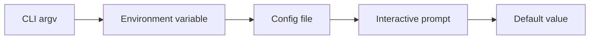

# Flags

Flags are the richest primitive in `dreamcli`.
Each flag declaration configures parsing, type inference, resolution, help text, and shell completions.

## Flag Types

### String

```ts twoslash
import { flag, type InferFlag } from '@kjanat/dreamcli';

const stringFlag = flag.string();

declare const flagTypes: {
  string: InferFlag<typeof stringFlag>;
};
// ---cut---
flagTypes.string;
//          ^?
```

#### String constraints

`flag.string()` accepts optional string constraints, either as an options
object or via chained methods (they compose — a later chained call overrides an
earlier value, including one set in the options object):

```ts
flag.string({ nonEmpty: true, pattern: /^ghp_/ });
flag.string().nonEmpty().pattern(/^ghp_/); // equivalent
flag.string().minLength(3).maxLength(64);
```

| Option      | Meaning                                     | Default |
| ----------- | ------------------------------------------- | ------- |
| `nonEmpty`  | Reject the empty string `''`                | `false` |
| `minLength` | Inclusive minimum length (UTF-16 units)     | none    |
| `maxLength` | Inclusive maximum length (UTF-16 units)     | none    |
| `pattern`   | RegExp the value must match                 | none    |

Constraints are checked in order **nonEmpty → minLength → maxLength →
pattern** and apply to every source — CLI, env, config, and prompt. On the
first failure, CLI parsing throws `INVALID_VALUE` while env/config/prompt
resolution reports `CONSTRAINT_VIOLATED` (both exit code `2`). Anchor patterns
with `^`/`$` for full-string matching; length bounds must be non-negative
integers and `minLength` must not exceed `maxLength` (violations throw where
the flag is declared). String constraints are surfaced in the exported JSON
Schema as `minLength` / `maxLength` / `pattern`.

### Number

```ts twoslash
import { flag, type InferFlag } from '@kjanat/dreamcli';

const numberFlag = flag.number();

declare const flagTypes: {
  number: InferFlag<typeof numberFlag>;
};
// ---cut---
flagTypes.number;
//         ^?
```

#### Numeric constraints

`flag.number()` accepts optional numeric constraints, either as an options
object or via chained methods (they compose — a later chained call overrides an
earlier value, including one set in the options object):

```ts
flag.number({ min: 0, max: 100, int: true });
flag.number().int().min(0).max(100); // equivalent
flag.number({ min: 0 }).max(100); // composes to { min: 0, max: 100 }
```

| Option   | Meaning                         | Default |
| -------- | ------------------------------- | ------- |
| `min`    | Inclusive lower bound           | none    |
| `max`    | Inclusive upper bound           | none    |
| `int`    | Require an integer              | `false` |
| `finite` | Reject `Infinity` / `-Infinity` | `true`  |

The resolved value type stays `number` — constraints are enforced at runtime
and surfaced in the exported JSON Schema (`minimum` / `maximum`, and
`type: "integer"` when `int` is set), not at the type level. `min` / `max` must
be finite; passing `Infinity` / `-Infinity` / `NaN` as a bound throws when the
flag is declared (omit the field for "no bound").

::: warning Finite by default
`flag.number()` now **rejects `Infinity` and `-Infinity`** (as well as `NaN`,
which was always rejected). Pass `finite: false` (or `.finite(false)`) to accept
non-finite values.
:::

Constraints are checked in order **finite → int → min → max**, and apply to
every source — CLI, env, config, and prompt. On the first failure, CLI parsing
throws `INVALID_VALUE` while env/config/prompt resolution reports
`CONSTRAINT_VIOLATED` (both exit code `2`):

| Input (`flag.number({ int: true, min: 0, max: 100 })`) | Result                               |
| ------------------------------------------------------ | ------------------------------------ |
| `42`                                                   | accepted                             |
| `0` / `100`                                            | accepted (bounds are inclusive)      |
| `NaN`                                                  | rejected — invalid number            |
| `Infinity`                                             | rejected — `must be a finite number` |
| `3.7`                                                  | rejected — `must be an integer`      |
| `-1`                                                   | rejected — `must be >= 0`            |
| `101`                                                  | rejected — `must be <= 100`          |

The same options and methods are available on `arg.number()` for positional
arguments.

### Boolean

```ts twoslash
import { flag, type InferFlag } from '@kjanat/dreamcli';

const booleanFlag = flag.boolean();

declare const flagTypes: {
  boolean: InferFlag<typeof booleanFlag>;
};
// ---cut---
flagTypes.boolean;
//         ^?
```

### Enum

```ts twoslash
import { flag, type InferFlag } from '@kjanat/dreamcli';

const enumFlag = flag.enum(['us', 'eu', 'ap']);

declare const flagTypes: {
  enum: InferFlag<typeof enumFlag>;
};
// ---cut---
flagTypes.enum;
//         ^?
```

### Array

```ts twoslash
import { flag, type InferFlag } from '@kjanat/dreamcli';

const arrayFlag = flag.array(flag.string());

declare const flagTypes: {
  array: InferFlag<typeof arrayFlag>;
};
// ---cut---
flagTypes.array;
//         ^?
```

Array flags resolve to `[]` when unset — they never resolve to `undefined`.

The element builder describes the *value shape only*: kinds and their value
constraints (`flag.number({ int: true, min: 0 })`, `.nonEmpty()`,
`.pattern()`, enum values, custom `parseFn`). Flag-level settings —
`.alias()`, `.env()`, `.default()`, `.prompt()`, `.describe()`, and friends —
belong on the array itself and are a **compile error** in element position,
since an element schema would silently ignore them:

```ts
flag.array(flag.number({ min: 1 })).env('PORTS').describe('Ports'); // ✓
// flag.array(flag.number().env('PORTS'))  ✗ compile error — env the array, not the element
```

`flag.path()`, `flag.count()`, `flag.keyValue()`, and nested `flag.array()`
are not element-eligible either.

#### Separators and deduplication

By default each occurrence of an array flag contributes exactly one element
(`--tag a --tag b`). With `.separator()`, each occurrence is also split, so
CSV-style input works alongside repetition — and each element is coerced
individually, so an error names the offending element, not the whole token:

```ts
flag.array(flag.enum(['us', 'eu', 'ap'])).separator(',').unique();
// --region us,eu --region eu  →  ['us', 'eu']
// --region us,mars            →  Invalid value 'mars' for flag --region. Allowed: us, eu, ap
```

`.unique()` deduplicates the final resolved array (first-seen order, `Set`
semantics), regardless of which source produced the values. Env and config
string values already split on `','` by default; `.separator()` changes that
delimiter everywhere (e.g. `MYAPP_REGION=us|eu` with `.separator('|')`).

### Custom

```ts twoslash
import { flag, type InferFlag } from '@kjanat/dreamcli';

const customFlag = flag.custom((v) => new URL(String(v)));

declare const flagTypes: {
  custom: InferFlag<typeof customFlag>;
};
// ---cut---
flagTypes.custom;
//         ^?
```

### URL

Parses into a `URL`; invalid URLs are rejected with the flag named in the
error. Optionally restrict protocols:

```ts twoslash
import { flag, type InferFlag } from '@kjanat/dreamcli';

const urlFlag = flag.url({ protocols: ['https'] });

declare const flagTypes: {
  url: InferFlag<typeof urlFlag>;
};
// ---cut---
flagTypes.url;
//        ^?
```

### Path

The value stays a `string` (help shows `<path>`), with optional filesystem
checks that run **after resolution** through the runtime adapter — so CLI,
env, and config values are validated identically:

```ts
flag.path(); // any string
flag.path({ mustExist: true }); // rejects missing paths
flag.path({ type: 'directory' }); // must exist and be a directory
flag.path({ type: 'directory', mustExist: false }); // missing passes; existing must be a directory
flag.path({ type: 'directory', create: true }); // created recursively when missing
```

`create` is only available with `type: 'directory'` (enforced at the type
level) and still rejects an existing non-directory path.

In process-free execution (`.execute()` / `runCommand()`), pass a `stat`
function via run options to enable the checks (plus `mkdir` for `create`);
without them the checks are skipped and nothing is created.

### Date

Accepts strict ISO-8601 (`2026-07-10`, `2026-07-10T14:30:00Z`) and parses into
a `Date`. Lenient `Date.parse` inputs (`'0'`, `'March 5'`) and
calendar-invalid dates (`2026-02-31`) are rejected. Offset-less datetimes
(`2026-07-10T14:30`) are treated as **UTC**, not local time, so `min` / `max`
acceptance never depends on the machine's timezone. Optional inclusive
`min` / `max` bounds:

```ts twoslash
import { flag, type InferFlag } from '@kjanat/dreamcli';

const dateFlag = flag.date({ min: new Date('2020-01-01') });

declare const flagTypes: {
  date: InferFlag<typeof dateFlag>;
};
// ---cut---
flagTypes.date;
//         ^?
```

### Duration

Accepts `'30s'`, `'5m'`, `'1.5h'`, `'250ms'`, `'2d'`, compounds like
`'1h30m'`, or a bare millisecond count — and resolves to **milliseconds**:

```ts
flag.duration().default(30_000);
// --timeout 45s   → 45000
// --timeout 1h30m → 5400000
```

### Bytes

Accepts `'512mb'`, `'1.5gb'`, `'64kb'`, `'100b'` or a bare byte count, and
resolves to **bytes**. Units are binary (`1kb` = 1024) and case-insensitive:

```ts
flag.bytes().default(10 * 1024 ** 2);
// --max-size 512kb → 524288
```

### Count

Resolves to how many times the flag appears — the classic verbosity pattern.
`-vvv`, `-v -v -v`, and `--verbose --verbose --verbose` all yield `3`; absent
yields `0`. An explicit value (`--verbose=2`, env, config) sets the count
directly. Count flags take no value token and are not promptable:

```ts twoslash
import { flag, type InferFlag } from '@kjanat/dreamcli';

const countFlag = flag.count().alias('v');

declare const flagTypes: {
  count: InferFlag<typeof countFlag>;
};
// ---cut---
flagTypes.count;
//         ^?
```

### Key-Value

Repeated `KEY=VALUE` occurrences merge into a `Record<string, string>`
(docker/kubectl `--env` style). The value is split at the **first** `=`, so
`--env A=b=c` yields `{ A: 'b=c' }`; later occurrences of the same key win.
Unset resolves to `{}`. Env vars accept comma-separated pairs (`A=1,B=2`) —
which means an env-sourced *value* cannot itself contain a comma; use the CLI
or a config file (plain object) for those:

```ts twoslash
import { flag, type InferFlag } from '@kjanat/dreamcli';

const kvFlag = flag.keyValue().alias('e');

declare const flagTypes: {
  env: InferFlag<typeof kvFlag>;
};
// ---cut---
flagTypes.env;
//         ^?
```

Array and key-value flags are the optional flag kinds that still resolve to a
value when unset: arrays fall back to `[]`, key-value flags to `{}`.

For the exact parser rules around repeated flags, short-flag stacking, `--`
separator handling, and `--no-*` spellings, see [CLI Semantics](/guide/semantics).

## Flag Names

The string you pass to `.flag(name, …)` is the flag's **canonical name**, and it is used in two
places at once:

- on the command line as `--name`;
- as the key on the `flags` object inside your handler.

The name you declare is the name you read — handler keys are never case-converted. Single-word
names are valid identifiers, so dot access works (`flags.region`). Hyphenated names are not valid
identifiers, so read them with bracket access (`flags['node-ipc']`).

```ts twoslash
import { command, flag } from '@kjanat/dreamcli';

command('serve')
  .flag(
    'node-ipc',
    flag.boolean().describe('Use the Node IPC transport'),
  )
  .flag('dry-run', flag.boolean())
  .action(({ flags, out }) => {
    // Hyphenated names are read with bracket access — there is no `flags.nodeIpc`.
    if (flags['node-ipc']) out.log('ipc');
    if (flags['dry-run']) out.log('dry run');
  });
```

Reach for a hyphenated name when you want the conventional CLI spelling (`--node-ipc`,
`--dry-run`); reach for a single-word or camelCase name (`--nodeIpc`) when ergonomic dot access
matters more. Either way users can type both spellings — see
[Spelling parity](#spelling-parity-kebab-camel) below.

### Spelling Parity (kebab ↔ camel) {#spelling-parity-kebab-camel}

On the command line, every flag name and long alias also accepts its kebab↔camel counterpart:
a flag named `dry-run` matches both `--dry-run` and `--dryRun`, and a flag named `dryRun`
matches both spellings too. The handler key is always the canonical name — parity is purely
CLI-token sugar, and help, completions, and "did you mean" suggestions advertise only the
declared spelling.

Two escape hatches:

- **Per pair, automatic** — if a command explicitly defines *both* spellings as separate flags
  (`do-this` and `doThis`), parity is disabled for that pair and each spelling matches only its
  own flag.
- **Globally** — pass `flags: { caseParity: false }` to the `cli()` factory (or to
  `cmd.run()` / `.execute()` options) to accept declared spellings only:

```ts twoslash
import { cli, command, flag } from '@kjanat/dreamcli';

cli('mycli', { flags: { caseParity: false } })
  .command(
    command('build')
      .flag('dry-run', flag.boolean())
      .action(() => {}),
  );
// $ mycli build --dry-run   → ok
// $ mycli build --dryRun    → Unknown flag --dryRun
```

Parity is not case-insensitivity: `--DRY-RUN` never matches.

### Aliases Are CLI Tokens, Not Handler Keys

`.alias()` adds an alternate **spelling on the command line**. It resolves back to the canonical
name — it never becomes a second property on `flags`.

```ts twoslash
import { command, flag } from '@kjanat/dreamcli';

command('serve')
  // Accepts both `--skip-pass` and `--skipPass` on the CLI…
  .flag('skip-pass', flag.boolean().alias('skipPass'))
  .action(({ flags, out }) => {
    // …but the handler has exactly one key: the canonical name.
    if (flags['skip-pass']) out.log('skipping');
  });
```

So typing `--skipPass` still arrives as `flags['skip-pass']`.

## Modifiers

Every flag type supports the same modifier chain:

```ts twoslash
import { flag } from '@kjanat/dreamcli';

flag
  .string()
  // short alias: -r
  .alias('r')
  // help text
  .describe('Target region')
  // default value (narrows type)
  .default('us')
  // must resolve or error
  .required()
  // resolve from env var
  .env('DEPLOY_REGION')
  // resolve from config file
  .config('deploy.region')
  // interactive fallback
  .prompt({ kind: 'input', message: 'Region?' })
  // deprecation warning
  .deprecated('Use --target instead')
  // inherit in subcommands
  .propagate();
```

## Negatable Booleans

`.negatable()` gives a boolean flag a negated spelling that sets it to `false` — the classic
`--sandbox` / `--no-sandbox` pair as **one logical flag**:

```ts twoslash
import { command, flag } from '@kjanat/dreamcli';

command('build')
  .flag(
    'sandbox',
    flag.boolean().default(true).negatable().describe('Run the build sandboxed'),
  )
  .action(({ flags, out }) => {
    if (!flags.sandbox) out.warn('sandbox disabled');
  });
// $ mycli build                → sandbox = true  (default)
// $ mycli build --sandbox      → sandbox = true
// $ mycli build --no-sandbox   → sandbox = false
```

Semantics:

- Both spellings are the same flag: the **last CLI occurrence wins** across them, and they share
  the flag's [duplicate policy](#duplicate-policy).
- The negated spelling is presence-only — `--no-sandbox=true` is an error. Explicit values stay
  on the positive spelling (`--sandbox=false`).
- Help renders the pair as one entry: `--[no-]sandbox`.
- Only CLI tokens are affected; env, config, prompt, and default resolution are unchanged.

Customize the spelling with `alias` (rendered as its own form) or keep it parseable but
unadvertised with `hidden`:

```ts twoslash
import { flag } from '@kjanat/dreamcli';

flag.boolean().negatable({ alias: 'plain' }); // --color / --plain
flag.boolean().negatable({ hidden: true }); // --no-… parses, help shows only the positive form
```

The negated spelling participates in schema-time collision validation — defining `no-sandbox` as
its own flag next to a negatable `sandbox` is an error.

## Duplicate Policy {#duplicate-policy}

By default, repeating a singleton flag on the command line is last-write-wins
(`--region us --region eu` → `'eu'`). For flags that are configuration knobs rather than
mergeable inputs, `.duplicates()` makes repeats explicit:

```ts twoslash
import { command, flag } from '@kjanat/dreamcli';

command('run')
  .flag('spawn', flag.enum(['session', 'same-dir', 'worktree']).duplicates('error'))
  .flag('capacity', flag.number().duplicates('first'))
  .action(() => {});
// $ mycli run --spawn session --spawn worktree
// #   → Error: Flag --spawn may only be specified once   (code: DUPLICATE_FLAG)
// $ mycli run --capacity 2 --capacity 9   → capacity = 2 (first wins)
```

- `'last'` — last occurrence wins (default, historic behavior).
- `'first'` — first occurrence wins; later occurrences still consume their value token, they just
  don't overwrite.
- `'error'` — a second occurrence throws a `ParseError` with code `DUPLICATE_FLAG` and
  `details: { flag, count, values }`.

Occurrences are counted per **logical flag** — aliases, negated spellings, and
[parity spellings](#spelling-parity-kebab-camel) all count toward the same flag. Only CLI tokens
count: a flag set both on the CLI and via env/config follows the normal precedence chain and is
never a duplicate. `.duplicates()` is unavailable on `array`, `count`, and `keyValue` flags,
which inherently accumulate.

## Resolution Chain

Each flag resolves through an ordered pipeline. Every step is opt-in:


```mermaid
flowchart LR
    A[CLI argv] --> B[Environment variable]
    B --> C[Config file]
    C --> D[Interactive prompt]
    D --> E[Default value]
```

The first source that provides a value wins.
Required flags that don't resolve produce a structured error before the action handler runs.

### Example

```ts twoslash
import { flag } from '@kjanat/dreamcli';

flag
  .enum(['us', 'eu', 'ap'])
  .env('DEPLOY_REGION')
  .config('deploy.region')
  .prompt({ kind: 'select', message: 'Which region?' })
  .default('us');
```

Resolution order:

1. `--region eu` on the command line
2. `DEPLOY_REGION=eu` in environment
3. `deploy.region: "eu"` in config file
4. Interactive select prompt (TTY only)
5. Default value `"us"`

## Required vs Optional

### Optional

```ts twoslash
import { flag, type InferFlag } from '@kjanat/dreamcli';

const optionalFlag = flag.string();

declare const requiredVsOptional: {
  optional: InferFlag<typeof optionalFlag>;
};
// ---cut---
requiredVsOptional.optional;
//                    ^?
```

### Defaulted

```ts twoslash
import { flag, type InferFlag } from '@kjanat/dreamcli';

const defaultedFlag = flag.string().default('hello');

declare const requiredVsOptional: {
  defaulted: InferFlag<typeof defaultedFlag>;
};
// ---cut---
requiredVsOptional.defaulted;
//                    ^?
```

### Required

```ts twoslash
import { flag, type InferFlag } from '@kjanat/dreamcli';

const requiredFlag = flag.string().required();

declare const requiredVsOptional: {
  required: InferFlag<typeof requiredFlag>;
};
// ---cut---
requiredVsOptional.required;
//                    ^?
```

### Boolean

```ts twoslash
import { flag, type InferFlag } from '@kjanat/dreamcli';

const booleanFlag = flag.boolean();

declare const requiredVsOptional: {
  boolean: InferFlag<typeof booleanFlag>;
};
// ---cut---
requiredVsOptional.boolean;
//                  ^?
```

## Custom Parsing

```ts twoslash
import { flag } from '@kjanat/dreamcli';

flag.custom((value) => {
  const url = new URL(String(value));
  if (url.protocol !== 'https:') {
    throw new Error('URL must use HTTPS');
  }
  return url;
});
```

The parse function receives the raw string value and returns the parsed type.
Thrown errors become validation errors with the flag name in context.

### Standard Schema Validators

`flag.custom()` also accepts any [Standard Schema v1](https://standardschema.dev/schema)
validator, including Zod, Valibot, and ArkType schemas:

```ts
import { flag } from '@kjanat/dreamcli';
import { z } from 'zod';

const port = flag.custom(z.coerce.number().int().min(1).max(65_535));
// inferred type: number | undefined
```

Standard Schema validation runs after source resolution, so the same sync or async validator
handles CLI, env, config, prompt, and default values. Validation issues become
`CONSTRAINT_VIOLATED` errors. When used as a `flag.array()` element, the validator runs once per
resolved element.

## Propagation

Flags marked with `.propagate()` are inherited by all subcommands:

```ts twoslash
import { cli, command, flag } from '@kjanat/dreamcli';

const nested = command('start')
  .flag('verbose', flag.boolean().alias('v').propagate())
  .action(({ flags, out }) => {
    if (flags.verbose) {
      out.info('Verbose mode enabled');
    }
  });
// ---cut-start---
// ---cut-end---

cli('mycli').command(
  command('deploy')
    .flag('verbose', flag.boolean().alias('v').propagate())
    .command(nested),
);
```

## What's Next?

- [Arguments](/guide/arguments) — positional argument types
- [Config Files](/guide/config) — config file resolution
- [Interactive Prompts](/guide/prompts) — prompt integration
- [CLI Semantics](/guide/semantics) — exact parser and precedence rules
