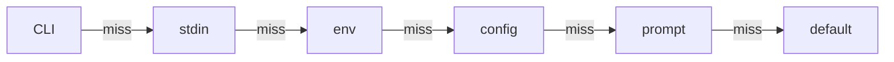
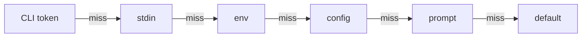
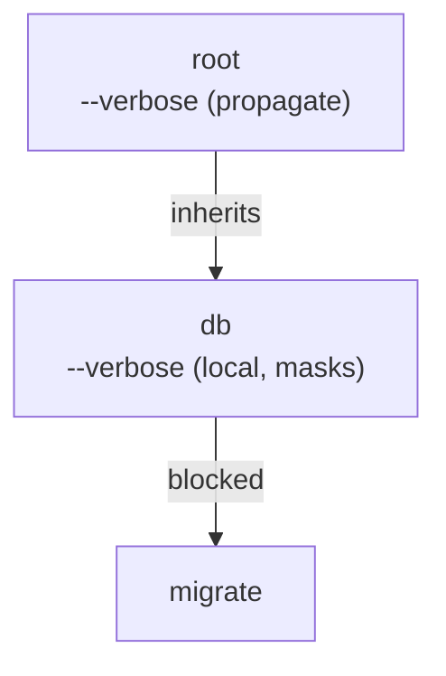

# CLI Semantics

This page is the canonical source of truth for dreamcli's edge-case behavior.
Use it when you need exact parser, resolver, or root-surface semantics rather than a feature
overview.

## Parser Rules

The tokenizer is schema-agnostic. It applies these rules before command-specific parsing starts:

| Raw argv form  | Meaning                                                                     |
| -------------- | --------------------------------------------------------------------------- |
| `--flag`       | long flag without an inline value                                           |
| `--flag=value` | long flag with an inline value                                              |
| `-abc`         | combined short flags                                                        |
| `--`           | end of options; everything after becomes positional                         |
| `-`            | stdin sentinel for an input declaring `.stdin()`, otherwise a plain positional |

Examples:

```text
deploy --region=eu prod
```

```json
["--region=eu", "prod"]
```

```text
deploy -- --region eu
```

After `--`, both `--region` and `eu` are treated as positional values.

## Flag Parsing

### Repeated flags

- Scalar flags overwrite earlier values. The last occurrence wins.
- Array flags accumulate in order.

```ts twoslash
import { flag } from '@kjanat/dreamcli';

flag.string(); // repeated -> last value wins
flag.number(); // repeated -> last value wins
flag.boolean(); // repeated -> true stays true unless an explicit false value is parsed
flag.array(flag.string()); // repeated -> accumulates
```

```bash
deploy --tag v1 --tag v2 --tag v3
```

Resolves to:

```json
{ "tag": ["v1", "v2", "v3"] }
```

### Boolean flags

- Bare boolean flags set the value to `true`.
- Long booleans also accept explicit inline values:
  - `--flag=true`
  - `--flag=false`
  - `--flag=1`
  - `--flag=0`
- Short booleans are presence-based. `-v` means `true`.

dreamcli does **not** implement special negated-boolean syntax automatically.
Call `.negatable()` on the boolean to accept `--no-confirm` alongside `--confirm`; see [Negatable Booleans](/guide/flags#negatable-booleans).

### Short-flag stacking

- Combined short booleans expand left to right: `-abc` means `-a -b -c`.
- If a short flag expects a value, it consumes either:
  - the rest of the current group, or
  - the next positional token if it is the last short flag in the group.

Examples:

```bash
-vo out.txt  # -> -v, then -o out.txt
-ofile.txt   # -> -o file.txt
-oVfile      # -> -o Vfile
```

Once a value-taking short flag consumes the remainder of the group, parsing of that group stops.

## Resolution Precedence

### Flags

Flags resolve in this order — the first source that provides a value wins:



Example:

```ts twoslash
import { flag } from '@kjanat/dreamcli';

flag
  .enum(['us', 'eu', 'ap'])
  .stdin()
  .env('DEPLOY_REGION')
  .config('deploy.region')
  .prompt({ kind: 'select', message: 'Region?' })
  .default('us');
```

Outcomes:

| Available sources                                 | Result |
| ------------------------------------------------- | ------ |
| `--region ap`, env=`eu`, config=`us`, prompt=`eu` | `ap`   |
| piped stdin `eu`, env=`ap`                        | `eu`   |
| env=`eu`, config=`ap`, prompt=`us`                | `eu`   |
| config=`ap`, prompt=`us`                          | `ap`   |
| prompt=`eu`                                       | `eu`   |
| no value sources                                  | `us`   |

Notes:

- Array flags that are not required and have no explicit default resolve to `[]`.
- Optional non-array flags resolve to `undefined` when no source provides a value.
- Required flags fail after the full chain is exhausted.

### Positional arguments

Positional arguments walk the same order as flags, and are CLI-only unless they
opt into extra sources. Only args that opt into `.stdin()`, `.env()`,
`.config()`, or `.prompt()` participate in those extra steps:



Example:

```ts twoslash
import { arg } from '@kjanat/dreamcli';

arg.string().stdin().env('DEPLOY_TARGET').config('deploy.target').default('local');
```

Outcomes:

| Available sources                      | Result    |
| -------------------------------------- | --------- |
| CLI token `prod`, stdin, env=`staging` | `prod`    |
| piped stdin `prod`, env=`staging`      | `prod`    |
| env=`staging`, config=`eu`             | `staging` |
| config=`eu`                            | `eu`      |
| no value sources                       | `local`   |

### Stdin

An input reads stdin only when it declares `.stdin()`. The binding has two
axes, `when` and `consume`, defaulting to `dash-or-missing` and `exclusive`.

| `when`              | `-` typed            | Input omitted        |
| ------------------- | -------------------- | -------------------- |
| `'dash'`            | reads stdin          | falls through to env |
| `'missing'`         | literal string `'-'` | reads stdin          |
| `'dash-or-missing'` | reads stdin          | reads stdin          |

A `-` that selects stdin resolves on the `cli` stage, so it outranks every later
source. An omitted input resolves on the `stdin` stage, which sits between `cli`
and `env`, so env, config, prompt, and a default never suppress the read. When
nothing is piped, both forms produce no value and the walk continues.

The stream is read at most once per invocation, and only when a declared binding
would fire. Declaring a second exclusive stdin input on one command, flag or
argument, throws `DUPLICATE_STDIN_INPUT` at build time; every stdin input on a
command that passes `{ consume: 'broadcast' }` receives the same buffer.

The whole buffer becomes the value. A `string` input keeps it byte for byte;
every other kind drops one trailing `\n`, `\r\n`, or `\r` before decoding, and
then accepts exactly what an env value accepts.

## Non-Interactive Behavior

Prompting is conditional, not mandatory.

- Prompts run only after CLI, stdin, env, and config resolution fail to provide a value.
- Prompts run only when a prompter is available.
- In normal CLI execution, auto-prompting is enabled only when `stdinIsTTY` is `true`.
- In non-interactive environments, prompt-backed values fall through to defaults or required-value
  errors.

Implications:

- CI, pipes, and redirected stdin do not trigger automatic prompts.
- Required prompt-backed flags still fail with a structured validation error when no other source
  resolves them.
- Prompt cancellation falls through to the default when one exists; otherwise required validation
  still applies.

## Propagation and Masking

Flags marked with `.propagate()` are inherited by descendant commands.

Important masking rules:

- Only ancestor flags marked `propagate: true` are inherited.
- A child command that defines the same flag name masks the ancestor's propagated flag.
- That masking applies even if the child flag does **not** propagate.
- Intermediate overrides block deeper descendants from receiving the ancestor definition.

Example shape:



`migrate` does not inherit root's propagated `--verbose`, because the intermediate `db` command
redefined the same flag name.

## Root and Default-Command Semantics

dreamcli distinguishes between executability and visibility.
Hidden commands stay executable, but they are omitted from root help and shell completions.

### Root help

- No default command: root usage shows `<command>`.
- Visible default command: root usage shows `[command]`.
- Single visible default command: root help merges the root summary with the default command's
  detailed help.
- Visible sibling commands: root help stays command-centric and lists commands instead of merging
  full default-command help.
- Hidden default command: still executable, but treated as invisible in root help.

Examples:

| Root shape                         | Help behavior                            |
| ---------------------------------- | ---------------------------------------- |
| default only, visible              | merged root + default help               |
| visible default + visible siblings | root command list                        |
| hidden default + visible sibling   | root command list without default        |
| no default                         | root command list with `<command>` usage |

### Root completions

Completion behavior depends on both the root shape and `rootMode`.

- `'subcommands'` is the default.
- `'surface'` additionally exposes the default command's root-usable flags at the CLI root.
- A single visible default command exposes its flags at the root even in `'subcommands'` mode.
- Hidden defaults are not surfaced through root completions.
- Root surface exposure includes the default command's own root-usable flags, not child-only flags
  from its subcommands.

Examples:

| Root shape                         | `rootMode`    | Root completion surface                            |
| ---------------------------------- | ------------- | -------------------------------------------------- |
| default `serve` + sibling `status` | `subcommands` | `serve`, `status`, root built-ins                  |
| default `serve` + sibling `status` | `surface`     | commands + root built-ins + `serve` root flags     |
| single visible default `serve`     | `subcommands` | command name + root built-ins + `serve` root flags |

### Command resolution with value-flags

When locating the command name in argv, dreamcli skips the token a space-separated value-flag
consumes, so that value is never mistaken for a command name. This is most visible with a default
command, where every token sits at the root level:

```bash
mycli --region status   # `status` is the value of --region (even if a command
                        # named `status` exists), so this runs the default command
mycli --region=status   # inline form, same result
mycli status            # a bare token dispatches the `status` command
```

The same applies one level down: `mycli db --tag x migrate` resolves `migrate`, not `x`. Boolean
flags take no value, so a following token is still treated as a command name. For example,
`mycli --verbose deploy` runs `deploy`. The `--` separator stops command-name scanning entirely;
everything after it is positional.

## Related Guides

- [Commands](/guide/commands)
- [Flags](/guide/flags)
- [Config Files](/guide/config)
- [Interactive Prompts](/guide/prompts)
- [Shell Completions](/guide/completions)
- [Semantic Delta Log](/reference/semantic-delta-log)
